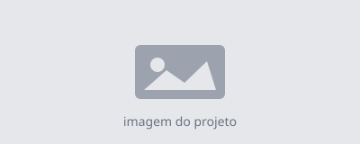

# Slides — Oficina Low-Code

> Convenção visual: conceitos-chave SEMPRE em **negrito**. As respostas do
> quiz estão plantadas nesse padrão. Não quebre a convenção — é o que disfarça
> as pistas.

---

## Slide 1 — Abertura
- Título: Enriquecendo seu portfólio com IA
- O que você vai construir (mostrar preview do portfólio final)
- Um bom portfólio tem **consistência visual**, **boa navegação**,
  **responsividade** e **informações claras sobre os projetos**.  [planta Q2]

## Slide 2 — Objetivos
- Ideia → IA gera código → testo → peço melhorias → versiono
- A IA não faz tudo. Você analisa, decide e aplica.

## Slide 3 — Setup (ORDEM IMPORTA)
1. VS Code
2. Extensão Live Server
3. Git  ← depois do VS Code!
4. "Use this template" no GitHub
5. git clone
6. Open with Live Server

## Slide 4 — O que é Low-Code
- Low-code = usar **ferramentas que reduzem a quantidade de código**
  necessária para desenvolver uma aplicação.  [planta Q1]
- Não é "sem código". É "menos código manual" — a IA escreve, você guia.

## Slide 5 — HTML e CSS em 2 minutos
- HTML = estrutura (o conteúdo). CSS = aparência (cores, layout).
- Você não precisa decorar: a IA mostra onde está e gera o que falta.

## Slide 6 — Responsividade
- Um site **responsivo** adapta o **layout** a qualquer tela:
  desktop, tablet, celular.
- Se algo aparece cortado no celular, o que revisar primeiro?
  A **responsividade do layout**.  [planta Q3]

## Slide 7 — Bloco 1: IA como navegadora
- Missão 1 — "Faça o portfólio ser seu"
- 1.1 Nome, título, curso | 1.2 Foto | 1.3 Cor de fundo
- CÓDIGO DE REFERÊNCIA (para quem não achar) — ver Slide 7b

## Slide 7b — Código de referência (Missão 1)
Onde está o nome:

    <h1>NOME_AQUI</h1>
    
TITULO_PROFISSIONAL_AQUI — CURSO_AQUI

Onde está a foto:

    

Onde está a cor de fundo (style.css):

    :root {
      --cor-fundo: #f4f4f9;   /* troque este valor */
    }

## Slide 8 — Checkpoint Git #1

    git add .
    git commit -m "personalização inicial do portfólio"

- add = seleciona o que vai no commit
- commit = tira uma "foto" do projeto
- mensagem = descreve o que mudou

## Slide 9 — Como escrever bons prompts
- Prompt fraco: "Crie um site bonito." / "Faça um portfólio profissional."
- Prompt forte: contexto + requisitos técnicos + formato esperado.
- Ex.: "Crie um portfólio **responsivo** com **componentes reutilizáveis**,
  **seção de projetos**, **navegação mobile** e **layout adaptável** para
  desktop, tablet e smartphone."  [planta Q4 — opção C]

## Slide 10 — Bloco 2: IA como criadora
- Missão 2 — "Deixe a IA trabalhar por você"
- 2.1 Sobre mim | 2.2 Habilidades | 2.3 Novo projeto
- CÓDIGO DE REFERÊNCIA — ver Slide 10b

## Slide 10b — Código de referência (Missão 2)
Seção Sobre mim:

    <section class="sobre">
      <h2>Sobre mim</h2>
      
ESCREVA_AQUI_UM_PARAGRAFO_SOBRE_VOCE

    </section>

Seção Habilidades:

    

      HABILIDADE_1
      HABILIDADE_2
      HABILIDADE_3
    

Card de projeto (copie o bloco inteiro para adicionar outro):

    

      
      

        <h3>NOME_DO_PROJETO</h3>
        
DESCRICAO_CURTA_DO_PROJETO

        <a href="#">Ver projeto</a>
      

    

## Slide 11 — Checkpoint Git #2

    git add .
    git commit -m "novas seções geradas com IA"

- Por que commitamos: histórico, segurança, poder voltar atrás.

## Slide 11b — Missão Bônus: "Deixe com a sua cara" (opcional)
Para quem terminou as missões — e para continuar depois da oficina.
A ideia é a mesma: você pede, a IA gera, você aplica. Agora o visual é SEU.

Troque a paleta de cores (style.css já tem as variáveis prontas no :root):

    "No meu style.css tenho estas variáveis de cor no :root:
    [cole o bloco :root]. Sugira uma nova paleta com a vibe
    [ex: tons de azul oceano / dark mode / minimalista].
    Mostre só o bloco :root atualizado."

Mude a fonte (Google Fonts):

    "Como adiciono a fonte [ex: Poppins] do Google Fonts no meu
    portfólio? Mostre o que colocar no <head> e no CSS."

Adicione um efeito de hover nos cards:

    "Adicione um efeito suave de hover nos .card-projeto: elevar
    um pouco e aumentar a sombra. Mostre só o CSS que preciso adicionar."

Crie uma seção nova (ex: Experiência):

    "Quero uma seção 'Experiência' no mesmo estilo das outras do meu
    portfólio. Aqui está o HTML de uma seção existente: [cole]. Mostre
    o HTML da nova seção."

Lembrete: testou e gostou? Faça um commit.

    git add .
    git commit -m "personalização visual (bônus)"

## Slide 12 — Publicação
- Subir o site para o GitHub e torná-lo público é fazer o **deploy**.  [planta Q5]
- git push → GitHub Pages → seu site no ar.

## Slide 13 — Quiz (15 min)
- 5 perguntas. Quem prestou atenção já viu todas as respostas. 😉
